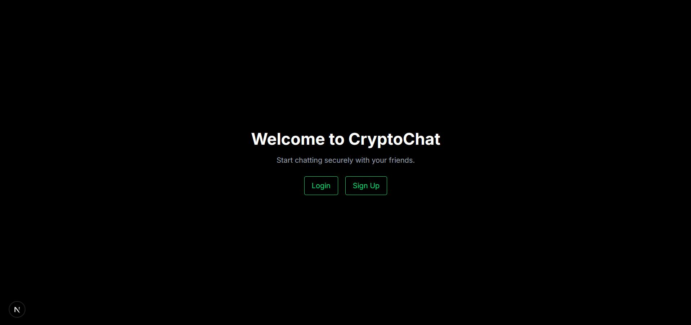
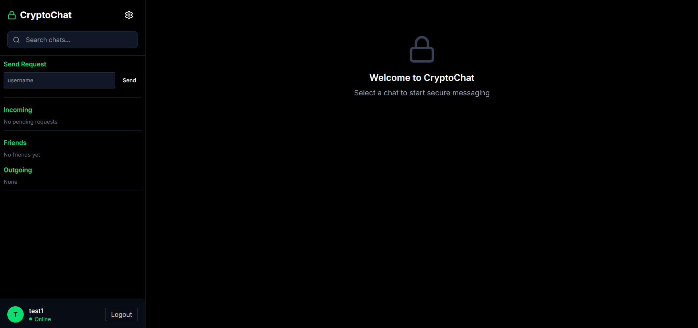
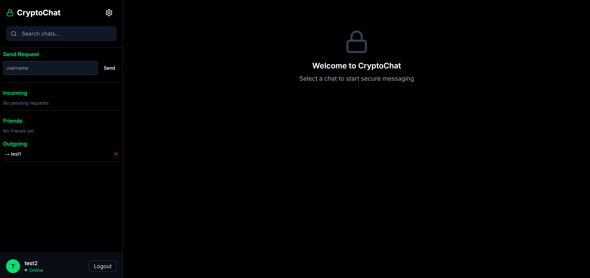
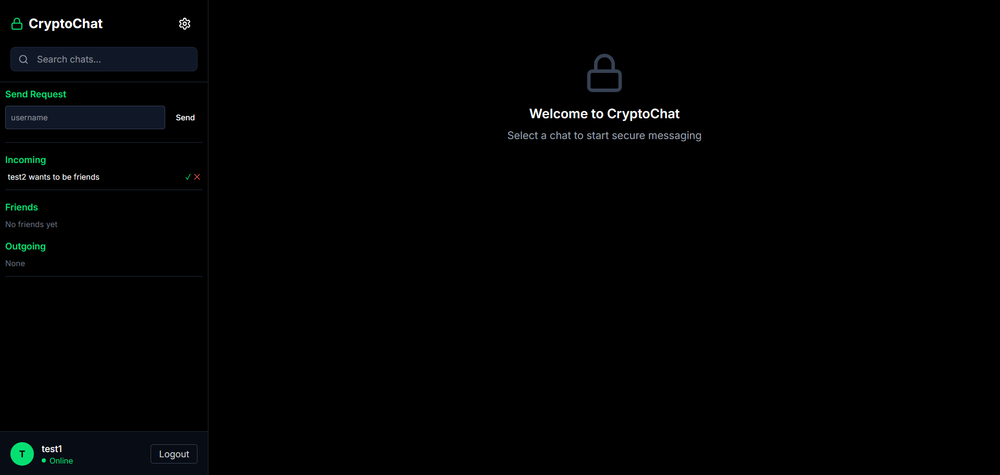
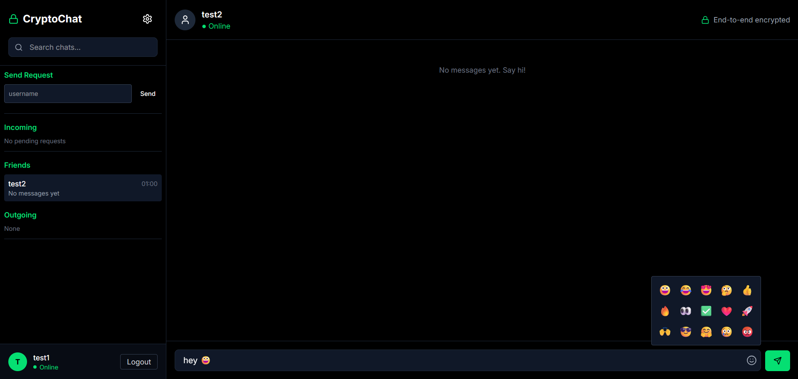
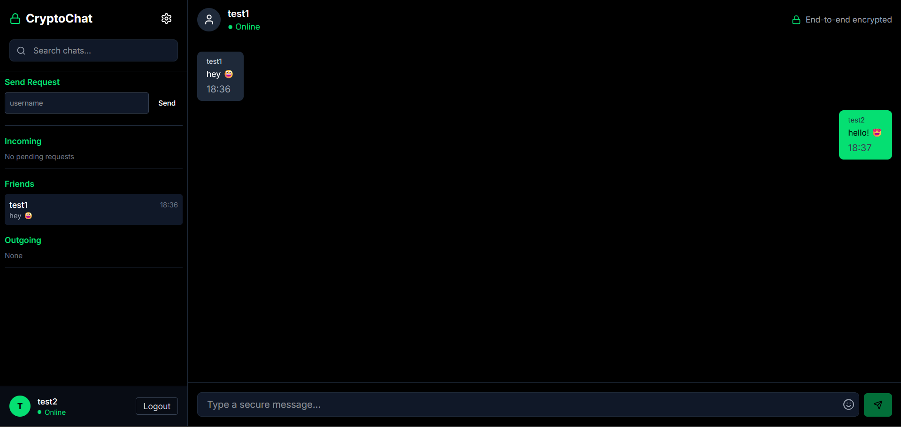
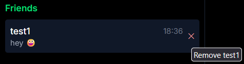

# CryptoChat

**Secure end-to-end encrypted messenger**

CryptoChat is a privacy-focused messaging application designed to implement end-to-end encryption for secure communication between users. The project is ongoing, with a focus on building a scalable and user-friendly platform that ensures data privacy.

## Key Highlights

- End-to-end encrypted messaging
- User authentication and account security
- Real-time communication with WebSockets
- Built using React (Typescript), Next.js, Tailwind CSS v4, and PostgreSQL with Prisma ORM  

## Production deployment

1. Provision PostgreSQL and set `DATABASE_URL`.
2. Generate a long random `SESSION_SECRET` with at least 32 characters.
3. Set `APP_ORIGIN` to the exact HTTPS origin users will visit.
4. Run `npx prisma migrate deploy`.
5. Build and start with `npm run build` and `npm start`.
6. Put the app behind HTTPS and a trusted reverse proxy that forwards the client IP.

The application fails closed in production when required configuration is missing. The in-process rate limiter is suitable for a single server instance; deployments with multiple instances should replace it with a shared Redis-backed limiter before scaling horizontally. Configure database backups, monitoring, structured log collection, and restore testing outside the application.

## Project Goals
- Demonstrate full-stack development and secure application design  
- Build a foundation for a scalable, privacy-focused messaging platform  
- Showcase modern frontend and backend development practices  

---

*This project is a work in progress, intended to highlight my skills in building secure, real-world applications with a modern web stack.*
